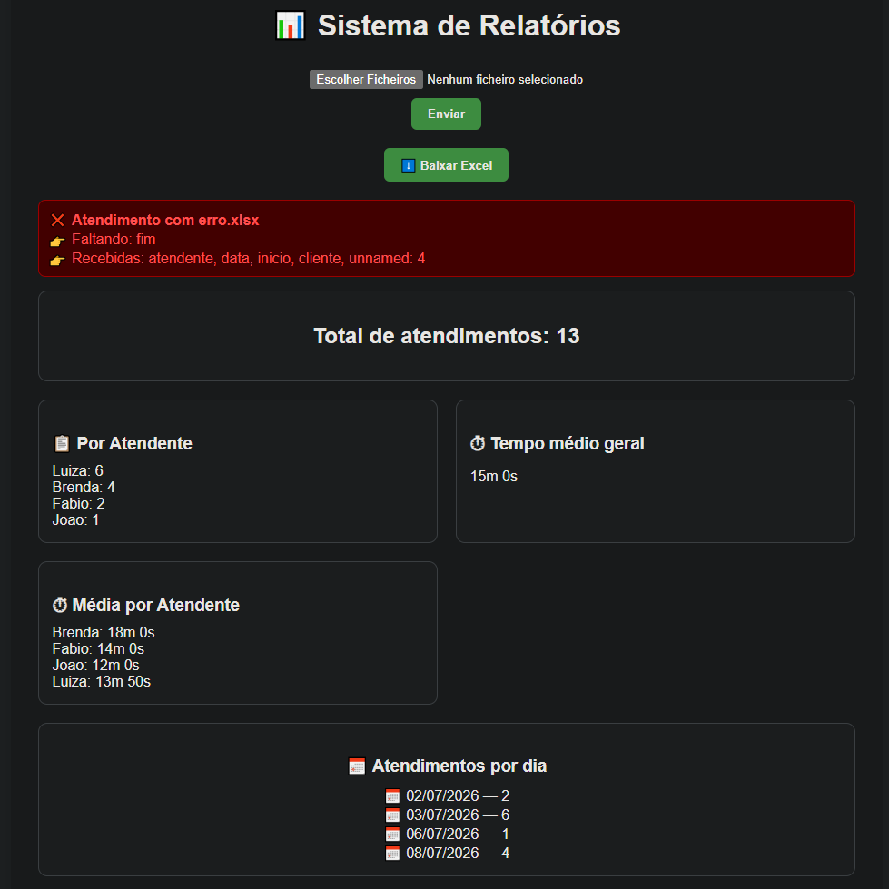
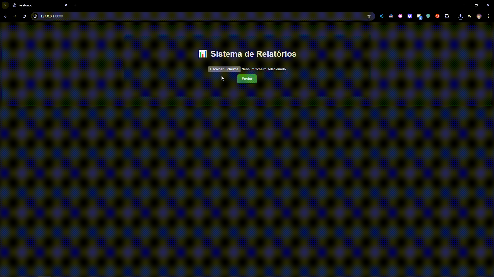

# 📊 Sistema de Relatórios de Atendimentos

<p align="center">
  
</p>

---

## 🎥 Demonstração

<p align="center">
  
</p>

---

## 🚀 Sobre o projeto

Sistema desenvolvido em **Python** com foco em **análise de dados, automação e geração de relatórios**.

A aplicação permite o envio de múltiplos arquivos de atendimentos, processa automaticamente os dados e gera métricas e relatórios profissionais de forma rápida e eficiente.

---

## ✨ Funcionalidades

✔ Upload de múltiplos arquivos (CSV e Excel)
✔ Processamento e limpeza automática dos dados
✔ Validação inteligente de arquivos (colunas obrigatórias)
✔ Tratamento automático de encoding

### 📊 Métricas geradas

* Total de atendimentos
* Atendimentos por atendente
* Tempo médio geral
* Tempo médio por atendente
* Atendimentos por dia

### 📄 Relatórios

* Exportação em **TXT**
* Exportação em **Excel** (com múltiplas abas)
* Download direto pelo navegador

### 🌐 Interface

* Interface web com Django
* Upload simplificado
* Feedback de erros e validação na tela

---

## 🛠 Tecnologias utilizadas

* Python
* Pandas
* Django
* OpenPyXL
* Chardet

---

## 🗺️ Roadmap

### ✅ v1.0

* Processamento de planilhas

### ✅ v1.1

* Relatórios em TXT

### ✅ v1.2

* Relatórios em Excel

### ✅ v2.0

* Estrutura web com Django

### ✅ v2.1

* Página HTML inicial

### ✅ v2.2

* Upload de múltiplos arquivos
* Suporte a CSV e Excel (.xlsx)
* Validação de dados
* Normalização de nomes
* Métricas avançadas
* Download de relatório via navegador

---

## 🟡 Próximos passos

* 📊 Dashboard com gráficos
* 🧱 Melhor organização do código (services / utils)
* ✅ Feedback visual de sucesso no upload
* ⚠ Melhor tratamento de erros na interface

---

## 🔮 Futuro

* Sistema de senhas para atendimento
* Registro automático de início e fim
* Dashboard em tempo real
* Banco de dados com histórico
* Sistema de login e permissões

---

## ⚙️ Como rodar o projeto

```bash
# Clone o repositório
git clone https://github.com/SEU-USUARIO/SEU-REPOSITORIO.git

# Acesse a pasta
cd relatorio_atendimentos

# Ative o ambiente virtual (Windows)
.\venv\Scripts\activate

# Entre na aplicação web
cd webapp

# Rode o servidor
python manage.py runserver
```

---

## 🌐 Acesse no navegador

http://127.0.0.1:8000/

---

## 📌 Observações

* Certifique-se de que os arquivos possuem as colunas obrigatórias
* O sistema realiza validação automática e exibirá erros na interface
* Ideal para análise de produtividade de atendimentos

---

## 👨‍💻 Autor 👨‍💻

Desenvolvido por Fábio Henrique.
